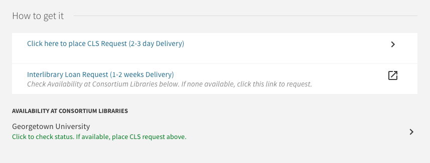

# Style CLS/AFN Option as Link
Styles the CLS option as a link to help users understand it as such. Thanks to Laura at GW.

## Usage
Add the styles in cls-option-style-as-link.css to you view's custom1.css file.

## Screenshot

